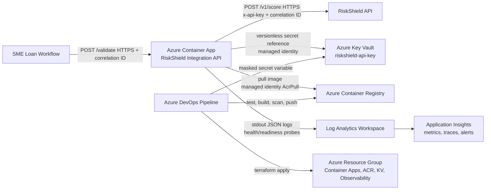

# FinSure RiskShield Integration Platform

Small Azure-based integration service for calling the RiskShield vendor API before a loan is approved.

## Live Dev Validation

The dev environment was deployed and tested on Azure Container Apps in `southafricanorth`. It uses ACR for the image, Key Vault for the RiskShield API key, managed identity for secret access, and Log Analytics/Application Insights for logs and basic monitoring.

The live endpoint is not committed here because it is internet-facing. For review, I can share the health/readiness URLs separately and tear the environment down afterwards.

## Repo Layout

- `app/`: Node.js REST API with `POST /validate`, health checks, JSON logs, correlation IDs, timeout handling, retry logic, and tests.
- `app/Dockerfile`: multi-stage image, non-root runtime user, Alpine base, and health check.
- `terraform/`: reusable Azure modules and dev/prod stacks for Container Apps, ACR, Key Vault, managed identity, Log Analytics, and Application Insights. Container App logs are sent through the Container Apps Environment Log Analytics integration.
- `pipelines/azure-pipelines.yml`: Azure DevOps pipeline for test/build/push, Terraform provisioning, production approval, deployment, and smoke test.
- `docs/architecture.mmd`: Mermaid version of the architecture diagram.

## Architecture



## API

`POST /validate`

```json
{
  "firstName": "Jane",
  "lastName": "Doe",
  "idNumber": "9001011234088"
}
```

Returns:

```json
{
  "riskScore": 72,
  "riskLevel": "MEDIUM"
}
```

The service accepts or generates `x-correlation-id`, passes it to RiskShield, and returns it in the response header. Applicant ID numbers are masked in logs because they are personal data.

## Run Locally

```bash
cd app
npm ci
npm test
npm run mock:riskshield
```

In another terminal:

```bash
cd app
RISKSHIELD_API_KEY=local-dev-key \
RISKSHIELD_BASE_URL=http://127.0.0.1:9090 \
npm start
```

Smoke test:

```bash
curl -sS -X POST http://127.0.0.1:8080/validate \
  -H 'content-type: application/json' \
  -H 'x-correlation-id: demo-001' \
  -d '{"firstName":"Jane","lastName":"Doe","idNumber":"9001011234088"}'
```

## Docker

```bash
cd app
docker build --platform linux/amd64 -t finsure-riskshield-service:local .
docker run --rm -p 8080:8080 \
  -e RISKSHIELD_API_KEY=local-dev-key \
  -e RISKSHIELD_BASE_URL=http://host.docker.internal:9090 \
  finsure-riskshield-service:local
```

Image notes:

- Multi-stage build runs tests before producing the runtime image.
- Runtime uses `node:22-alpine` and the built-in `node` non-root user.
- No third-party app packages are pulled from npm, which keeps the image smaller and easier to review.

## Terraform Deployment

Terraform state is stored in Azure Storage. Bootstrap once:

```bash
TFSTATE_STORAGE_ACCOUNT="stfinsure1782670901"

az group create -n rg-finsure-tfstate -l southafricanorth
az storage account create \
  -g rg-finsure-tfstate \
  -n "$TFSTATE_STORAGE_ACCOUNT" \
  -l southafricanorth \
  --sku Standard_LRS \
  --https-only true \
  --min-tls-version TLS1_2
az storage container create \
  --account-name "$TFSTATE_STORAGE_ACCOUNT" \
  -n tfstate \
  --auth-mode login
```

The backend files currently use `stfinsure1782670901`. If you choose a different globally unique storage account name, update `storage_account_name` in all `terraform/backend.*.hcl` files before running `terraform init`. The tfvars default to `southafricanorth` for South African data residency; change `location` if Container Apps is not enabled for your subscription in that region.

Deploy foundation:

```bash
cd terraform/stacks/foundation
terraform init -backend-config=../../backend.foundation.dev.hcl
terraform plan -var-file=env/dev.tfvars -out=tfplan
terraform apply tfplan
```

Seed the vendor secret without putting it in Terraform state:

```bash
KEY_VAULT_NAME="$(terraform output -raw key_vault_name)"
az keyvault secret set \
  --vault-name "$KEY_VAULT_NAME" \
  --name riskshield-api-key \
  --value "$RISKSHIELD_API_KEY"
```

With Key Vault RBAC enabled, the identity running this command needs `Key Vault Secrets Officer`. For pipeline usage, grant that permission only to the service principal used by the deployment pipeline.

Build and push the image:

```bash
ACR_NAME="$(terraform output -raw acr_name)"
ACR_LOGIN_SERVER="$(terraform output -raw acr_login_server)"
az acr login --name "$ACR_NAME"
docker build --platform linux/amd64 -t "$ACR_LOGIN_SERVER/riskshield-service:latest" ../../../app
docker push "$ACR_LOGIN_SERVER/riskshield-service:latest"
```

Deploy app:

```bash
cd ../app
terraform init -backend-config=../../backend.app.dev.hcl
terraform plan -var-file=env/dev.tfvars -var=image_tag=latest -out=tfplan
terraform apply tfplan
terraform output -raw app_url
```

Dev uses `min_replicas = 0` to reduce cost. Prod uses `min_replicas = 1` so the loan approval path does not start cold.

## CI/CD

Azure DevOps YAML is included at `pipelines/azure-pipelines.yml`. It runs tests, builds and pushes the container image, applies Terraform, deploys the Container App, and smoke tests `/healthz`.

Pipeline secrets and environment-specific values come from Azure DevOps service connections and variable groups, not from the repo.

## Security Considerations

- Secret handling: RiskShield API key is stored in Key Vault and injected into Container Apps through a managed identity Key Vault reference. It is not stored in code, the image, or Terraform state.
- Identity: User-assigned managed identity has only `AcrPull` on ACR and `Key Vault Secrets User` on the vault.
- Transport: Container Apps ingress disables insecure HTTP and exposes HTTPS.
- PII: `idNumber` is validated and masked in logs. Responses do not echo applicant details.
- Observability: logs include correlation ID, vendor latency, retry attempts, and sanitized error codes.
- Network: public ingress can be restricted with `allowed_ip_ranges`; production can move to internal Container Apps Environment and private endpoints if the lending workflow is inside a private network.
- Operations: readiness checks fail when the vendor secret is missing; liveness checks avoid restarting the app for vendor outages.

## Threat Model Summary

| Threat | Mitigation |
| --- | --- |
| API key leakage | Key Vault storage, managed identity access, no secret in Terraform state or image. |
| PII leakage | No applicant payload logging; ID number masking; `cache-control: no-store`. |
| Vendor outage or slow response | Short timeout, bounded retries with jitter, 502/503/504 mapping. |
| Replay or unauthorised caller | HTTPS-only baseline; add Entra ID auth/API Management before internet-facing production use. |
| Overly broad cloud permissions | Least-privilege role assignments scoped to ACR and Key Vault. |
| Cost runaway | Consumption Container Apps, small CPU/memory, max replica caps, ACR Basic, retention by environment. |

## Trade-Offs

- Azure Container Apps was chosen over AKS to avoid cluster management overhead and extra cost for a single integration service.
- The app has no external npm dependencies. That keeps the image small and reviewable, but a larger API would probably move to Fastify or NestJS for routing and schema management.
- Dev can scale to zero for savings. Prod keeps one warm replica because loan approval latency matters.
- The example deploys direct public HTTPS ingress for assessment simplicity. A production fintech deployment would usually front this with API Management, Entra ID, WAF rules, and private networking where the calling system allows it.
