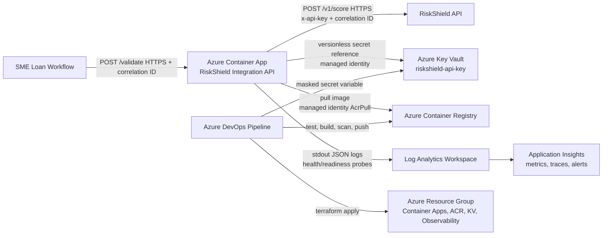

# FinSure RiskShield Integration Platform

Assessment-ready implementation for a secure vendor payment risk scoring integration on Azure.

## Live Dev Deployment

- Health: <https://ca-finsure-rs-dev-san-001.wonderfulsea-88f4e2f8.southafricanorth.azurecontainerapps.io/healthz>
- Readiness: <https://ca-finsure-rs-dev-san-001.wonderfulsea-88f4e2f8.southafricanorth.azurecontainerapps.io/readyz>

The dev environment is deployed to Azure Container Apps in `southafricanorth`. It uses ACR for the container image, Key Vault for the RiskShield API key, managed identity for secret access, and Log Analytics/Application Insights for observability.

## What Is Included

- `app/`: dependency-light Node.js REST API with `POST /validate`, health checks, structured JSON logs, correlation IDs, timeout handling, retry logic, and tests.
- `app/Dockerfile`: multi-stage production image, non-root runtime user, Alpine base, health check, no application dependencies.
- `terraform/`: reusable Azure modules and dev/prod stacks for Container Apps, ACR, Key Vault, managed identity, Log Analytics, and Application Insights. Container App logs are sent through the Container Apps Environment Log Analytics integration.
- `pipelines/azure-pipelines.yml`: Azure DevOps pipeline for test/build/push, Terraform provisioning, production approval, deployment, and smoke test.
- `docs/architecture.mmd`: Mermaid architecture diagram.

## Architecture



## API

`POST /validate`

```json
{
  "firstName": "Jane",
  "lastName": "Doe",
  "idNumber": "9001011234088"
}
```

Returns:

```json
{
  "riskScore": 72,
  "riskLevel": "MEDIUM"
}
```

The service accepts or generates `x-correlation-id`, passes it to RiskShield, and returns it in the response header. Applicant ID numbers are masked in logs because they are PII.

## Run Locally

```bash
cd app
npm ci
npm test
npm run mock:riskshield
```

In another terminal:

```bash
cd app
RISKSHIELD_API_KEY=local-dev-key \
RISKSHIELD_BASE_URL=http://127.0.0.1:9090 \
npm start
```

Smoke test:

```bash
curl -sS -X POST http://127.0.0.1:8080/validate \
  -H 'content-type: application/json' \
  -H 'x-correlation-id: demo-001' \
  -d '{"firstName":"Jane","lastName":"Doe","idNumber":"9001011234088"}'
```

## Docker

```bash
cd app
docker build --platform linux/amd64 -t finsure-riskshield-service:local .
docker run --rm -p 8080:8080 \
  -e RISKSHIELD_API_KEY=local-dev-key \
  -e RISKSHIELD_BASE_URL=http://host.docker.internal:9090 \
  finsure-riskshield-service:local
```

Image choices:

- Multi-stage build runs tests before producing the runtime image.
- Runtime uses `node:22-alpine` and the built-in `node` non-root user.
- No application packages are pulled from npm, reducing supply-chain and patching surface.

## Terraform Deployment

Remote state is expected in Azure Storage. Bootstrap once:

```bash
az group create -n rg-finsure-tfstate -l southafricanorth
az storage account create \
  -g rg-finsure-tfstate \
  -n stfinsuretfstate001 \
  -l southafricanorth \
  --sku Standard_LRS \
  --https-only true \
  --min-tls-version TLS1_2
az storage container create \
  --account-name stfinsuretfstate001 \
  -n tfstate \
  --auth-mode login
```

Storage account names are globally unique, so adjust `stfinsuretfstate001` in the backend files if it is already taken. The tfvars default to `southafricanorth` for South African data residency; switch `location` if Container Apps is not enabled for your subscription in that region.

Deploy foundation:

```bash
cd terraform/stacks/foundation
terraform init -backend-config=../../backend.foundation.dev.hcl
terraform plan -var-file=env/dev.tfvars -out=tfplan
terraform apply tfplan
```

Seed the vendor secret without putting it in Terraform state:

```bash
KEY_VAULT_NAME="$(terraform output -raw key_vault_name)"
az keyvault secret set \
  --vault-name "$KEY_VAULT_NAME" \
  --name riskshield-api-key \
  --value "$RISKSHIELD_API_KEY"
```

With Key Vault RBAC enabled, the identity running this command needs `Key Vault Secrets Officer`. Set `key_vault_secret_officer_object_ids` in the foundation tfvars to the Azure DevOps service connection principal object ID, or grant an equivalent role through your normal access process.

Build and push the image:

```bash
ACR_NAME="$(terraform output -raw acr_name)"
ACR_LOGIN_SERVER="$(terraform output -raw acr_login_server)"
az acr login --name "$ACR_NAME"
docker build --platform linux/amd64 -t "$ACR_LOGIN_SERVER/riskshield-service:latest" ../../../app
docker push "$ACR_LOGIN_SERVER/riskshield-service:latest"
```

Deploy app:

```bash
cd ../app
terraform init -backend-config=../../backend.app.dev.hcl
terraform plan -var-file=env/dev.tfvars -var=image_tag=latest -out=tfplan
terraform apply tfplan
terraform output -raw app_url
```

Dev uses `min_replicas = 0` to reduce cost. Prod uses `min_replicas = 1` to avoid cold starts in a loan approval path.

## Azure DevOps

Pipeline: `pipelines/azure-pipelines.yml`

This repository is ready to run in Azure DevOps at `https://dev.azure.com/maleterachel/`.

### 1. Create The Azure DevOps Project

1. Open <https://dev.azure.com/maleterachel/>.
2. Select **New project**.
3. Use project name `finsure-riskshield-platform`.
4. Set visibility to **Private**.
5. Use **Git** for version control.
6. Create the project.

### 2. Install The Terraform Pipeline Task

The YAML uses `TerraformInstaller@1`.

1. In Azure DevOps, open **Organization settings**.
2. Open **Extensions**.
3. Install the **Terraform** extension from Microsoft DevLabs if it is not already installed.

If your organisation does not allow marketplace extensions, replace the `TerraformInstaller@1` steps with your organisation's standard Terraform installer.

### 3. Create Service Connections

Go to **Project settings > Service connections**.

Create an Azure Resource Manager service connection:

- Type: **Azure Resource Manager**
- Authentication: service principal / workload identity federation is preferred when available
- Subscription: `Azure subscription 1`
- Name: `finsure-riskshield-azure`
- Grant access permission to all pipelines: enabled

Create an Azure Container Registry service connection:

- Type: **Docker Registry**
- Registry type: **Azure Container Registry**
- Registry: `acrfinsurersdevsan001`
- Name: `finsure-riskshield-acr`
- Grant access permission to all pipelines: enabled

The Azure service connection principal needs enough permission to run Terraform. For this assessment/dev deployment, assign it `Contributor` and `User Access Administrator` on the subscription so Terraform can create resources and role assignments. After assessment, reduce this to narrower resource-group scopes.

```bash
SUBSCRIPTION_ID="2a3014bb-4487-4706-ad3d-94569ac6ecaf"
SP_APP_ID="<azure-devops-service-connection-application-client-id>"
SP_OBJECT_ID="$(az ad sp show --id "$SP_APP_ID" --query id -o tsv)"

az role assignment create \
  --assignee-object-id "$SP_OBJECT_ID" \
  --assignee-principal-type ServicePrincipal \
  --role "Contributor" \
  --scope "/subscriptions/$SUBSCRIPTION_ID"

az role assignment create \
  --assignee-object-id "$SP_OBJECT_ID" \
  --assignee-principal-type ServicePrincipal \
  --role "User Access Administrator" \
  --scope "/subscriptions/$SUBSCRIPTION_ID"
```

The same service principal also needs to set the Key Vault secret during the pipeline run:

```bash
SP_APP_ID="<azure-devops-service-connection-application-client-id>"
SP_OBJECT_ID="$(az ad sp show --id "$SP_APP_ID" --query id -o tsv)"
KEY_VAULT_ID="$(az keyvault show \
  --name kv-finsure-rs-dev-001 \
  --resource-group rg-finsure-rs-dev-san-001 \
  --query id -o tsv)"

az role assignment create \
  --assignee-object-id "$SP_OBJECT_ID" \
  --assignee-principal-type ServicePrincipal \
  --role "Key Vault Secrets Officer" \
  --scope "$KEY_VAULT_ID"
```

### 4. Create Variable Groups

Go to **Pipelines > Library** and create these variable groups.

`finsure-riskshield-shared`

| Variable | Value |
| --- | --- |
| `azureServiceConnection` | `finsure-riskshield-azure` |
| `acrServiceConnection` | `finsure-riskshield-acr` |
| `acrLoginServer` | `acrfinsurersdevsan001.azurecr.io` |
| `riskShieldSecretName` | `riskshield-api-key` |
| `approvalNotifyUsers` | your Azure DevOps email address |

`finsure-riskshield-dev`

| Variable | Value |
| --- | --- |
| `RiskShieldApiKey` | mark as secret; use the real vendor key or `demo-riskshield-key` for demo |

`finsure-riskshield-prod`

| Variable | Value |
| --- | --- |
| `RiskShieldApiKey` | mark as secret; use the production vendor key when available |

### 5. Create Pipeline Environments

Go to **Pipelines > Environments**.

Create:

- `finsure-riskshield-dev`
- `finsure-riskshield-prod`

For `finsure-riskshield-prod`, add an approval check so production deploys require manual approval.

### 6. Create The Pipeline

1. Go to **Pipelines > New pipeline**.
2. Select **GitHub** if this repo is hosted in GitHub, or **Azure Repos Git** if you imported it into Azure Repos.
3. Select the repository.
4. Choose **Existing Azure Pipelines YAML file**.
5. Select `/pipelines/azure-pipelines.yml`.
6. Save and run.
7. Choose `dev` for the `environment` parameter.

The pipeline will:

1. Run Node.js tests.
2. Build and push the Docker image to ACR.
3. Run Terraform against the Azure Storage remote backend.
4. Seed the RiskShield API key into Key Vault from a masked pipeline variable.
5. Deploy the Container App.
6. Smoke test `/healthz`.

If a new Azure DevOps organisation reports no Microsoft-hosted parallelism, request the free hosted agent grant from Microsoft or configure a self-hosted agent. The YAML itself does not need to change.

### 7. Current Dev Values

Existing Azure dev resources created during validation:

- Resource group: `rg-finsure-rs-dev-san-001`
- ACR: `acrfinsurersdevsan001`
- Key Vault: `kv-finsure-rs-dev-001`
- Container App: `ca-finsure-rs-dev-san-001`
- App URL: <https://ca-finsure-rs-dev-san-001.wonderfulsea-88f4e2f8.southafricanorth.azurecontainerapps.io>

## Security Considerations

- Secret handling: RiskShield API key is stored in Key Vault and injected into Container Apps through a managed identity Key Vault reference. It is not stored in code, container image, or Terraform state.
- Identity: User-assigned managed identity has only `AcrPull` on ACR and `Key Vault Secrets User` on the vault.
- Transport: Container Apps ingress disables insecure HTTP and exposes HTTPS.
- PII: `idNumber` is validated and masked in logs. Responses do not echo applicant details.
- Observability: structured logs include correlation ID, vendor latency, retry attempts, and sanitized error codes.
- Network: public ingress can be restricted with `allowed_ip_ranges`; production can move to internal Container Apps Environment and private endpoints if the lending workflow is inside a private network.
- Operations: readiness checks fail when the vendor secret is missing; liveness checks avoid restarting the app for vendor outages.

## Threat Model Summary

| Threat | Mitigation |
| --- | --- |
| API key leakage | Key Vault storage, managed identity access, no secret in Terraform state or image. |
| PII leakage | No applicant payload logging; ID number masking; `cache-control: no-store`. |
| Vendor outage or slow response | Short timeout, bounded retries with jitter, 502/503/504 mapping. |
| Replay or unauthorised caller | HTTPS-only baseline; add Entra ID auth/API Management before internet-facing production use. |
| Overly broad cloud permissions | Least-privilege role assignments scoped to ACR and Key Vault. |
| Cost runaway | Consumption Container Apps, small CPU/memory, max replica caps, ACR Basic, retention by environment. |

## Trade-Offs

- Azure Container Apps was chosen over AKS to avoid cluster management overhead and cost for a single integration service.
- The app has no external npm dependencies. That keeps the image small and reviewable, but a larger API would likely move to Fastify or NestJS for routing and schema management.
- Dev can scale to zero for savings. Prod keeps one warm replica because loan approval latency matters.
- The example deploys direct public HTTPS ingress for assessment simplicity. A production fintech deployment would usually front this with API Management, Entra ID, WAF rules, and private networking where the calling system allows it.
